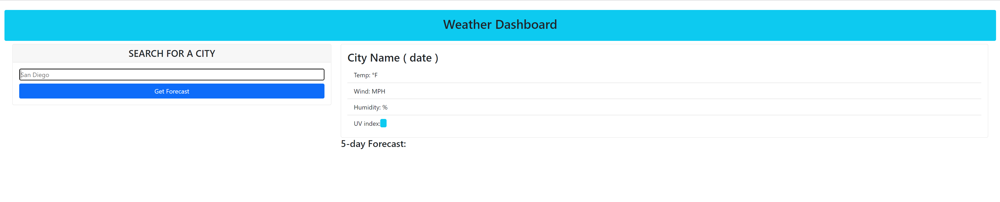
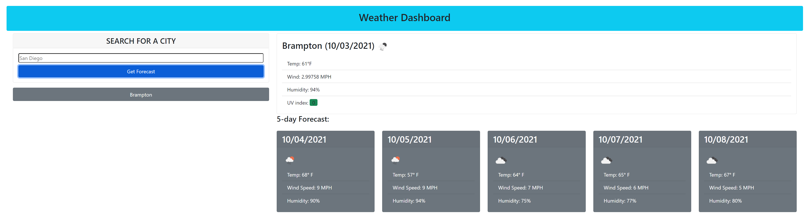
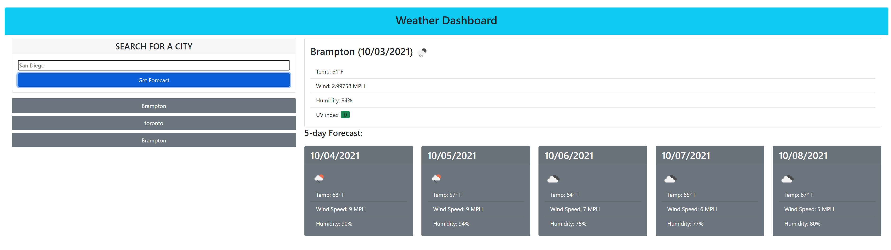

# weather-forecast-app

## Link to Application
Click on link to see the deployed website [https://sehaj97.github.io/weather-forecast-app/](https://sehaj97.github.io/weather-forecast-app/)

## Description
Weather forecast app that will display the current weather conditions and forecast for next 5 days using the api [https://openweathermap.org/api/](https://openweathermap.org/api/)

This app will run in the browser and feature dynamically updated HTML and CSS powered by jQuery, bootstrap and momentjs.

search history for the app stores upto for 8 previous valid search, if you refresh the page the search history will clear up

## Screenshots

### screenshot when page loads

### screenshot when you add a city

### screenshot for search history of upto 8 previous cities
